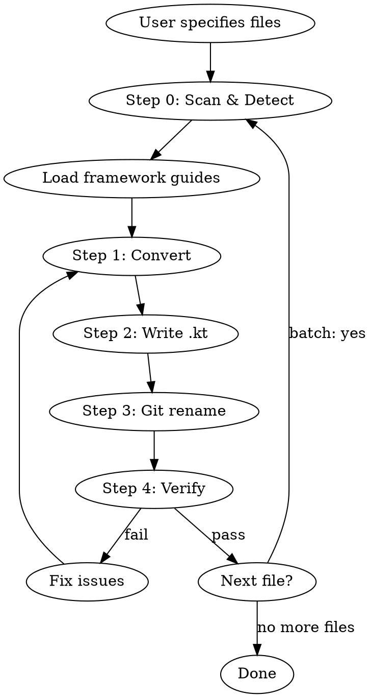

# Java to Kotlin Conversion

Convert Java source files to idiomatic Kotlin using a disciplined 4-step conversion
methodology with 5 invariants checked at each step. Supports framework-aware conversion
that handles annotation site targets, library idioms, and API preservation.

## Workflow



## Step 0: Scan & Detect Frameworks

Before converting, scan the Java file's import statements to detect which frameworks
are in use. Load ONLY the matching framework reference files to keep context focused.

### Framework Detection Table

| Import prefix | Framework guide |
|---|---|
| `org.springframework.*` | [SPRING.md](references/frameworks/SPRING.md) |
| `lombok.*` | [LOMBOK.md](references/frameworks/LOMBOK.md) |
| `javax.persistence.*`, `jakarta.persistence.*`, `org.hibernate.*` | [HIBERNATE.md](references/frameworks/HIBERNATE.md) |
| `com.fasterxml.jackson.*` | [JACKSON.md](references/frameworks/JACKSON.md) |
| `io.micronaut.*` | [MICRONAUT.md](references/frameworks/MICRONAUT.md) |
| `io.quarkus.*`, `javax.enterprise.*`, `jakarta.enterprise.*` | [QUARKUS.md](references/frameworks/QUARKUS.md) |
| `dagger.*`, `dagger.hilt.*` | [DAGGER-HILT.md](references/frameworks/DAGGER-HILT.md) |
| `io.reactivex.*`, `rx.*` | [RXJAVA.md](references/frameworks/RXJAVA.md) |
| `org.junit.*`, `org.testng.*` | [JUNIT.md](references/frameworks/JUNIT.md) |
| `com.google.inject.*` | [GUICE.md](references/frameworks/GUICE.md) |
| `retrofit2.*`, `okhttp3.*` | [RETROFIT.md](references/frameworks/RETROFIT.md) |
| `org.mockito.*` | [MOCKITO.md](references/frameworks/MOCKITO.md) |

If `javax.inject.*` is detected, check for Dagger/Hilt vs Guice by looking for other
imports from those frameworks. If ambiguous, load both guides.

## Step 1: Convert

Apply the conversion methodology from [CONVERSION-METHODOLOGY.md](references/CONVERSION-METHODOLOGY.md).

This is a 4-step chain-of-thought process:
1. **Faithful 1:1 translation** — exact semantics preserved
2. **Nullability & mutability audit** — val/var, nullable types
3. **Collection type conversion** — Java mutable → Kotlin types
4. **Idiomatic transformations** — properties, string templates, lambdas

Five invariants are checked after each step. If any invariant is violated, revert
to the previous step and redo.

Apply any loaded framework-specific guidance during step 4 (idiomatic transformations).

## Step 2: Write Output

Write the converted Kotlin code to a `.kt` file with the same name as the original
Java file, in the same directory.

## Step 3: Preserve Git History

To preserve `git blame` history, use a two-phase approach:

```bash
# Phase 1: Rename (creates rename tracking)
git mv src/main/java/com/example/Foo.java src/main/kotlin/com/example/Foo.kt
git commit -m "Rename Foo.java to Foo.kt"

# Phase 2: Replace content (tracked as modification, not new file)
# Write the converted Kotlin content to Foo.kt
git commit -m "Convert Foo from Java to Kotlin"
```

If the project keeps Java and Kotlin in the same source root (e.g., `src/main/java/`),
rename in place:

```bash
git mv src/main/java/com/example/Foo.java src/main/java/com/example/Foo.kt
```

If the project does not use Git, simply write the `.kt` file and delete the `.java` file.

## Step 4: Verify

After conversion, verify using [checklist.md](assets/checklist.md):
- Attempt to compile the converted file
- Run existing tests
- Check annotation site targets
- Confirm no behavioral changes

## Batch Conversion

When converting multiple files (a directory or package):

1. **List all `.java` files** in the target scope
2. **Sort by dependency order** — convert leaf dependencies first (files that don't
   import other files in the conversion set), then work up to files that depend on them
3. **Convert one file at a time** — apply the full workflow (steps 0-4) for each
4. **Track progress** — report which files are done, which remain
5. **Handle cross-references** — after converting a file, update imports in other Java
   files if needed (e.g., if a class moved packages)

For large batches, consider converting in packages (bottom-up from leaf packages).

## Common Pitfalls

See [KNOWN-ISSUES.md](references/KNOWN-ISSUES.md) for:
- Kotlin keyword conflicts (`when`, `in`, `is`, `object`)
- SAM conversion ambiguity
- Platform types from Java interop
- `@JvmStatic` / `@JvmField` / `@JvmOverloads` usage
- Checked exceptions and `@Throws`
- Wildcard generics → Kotlin variance
