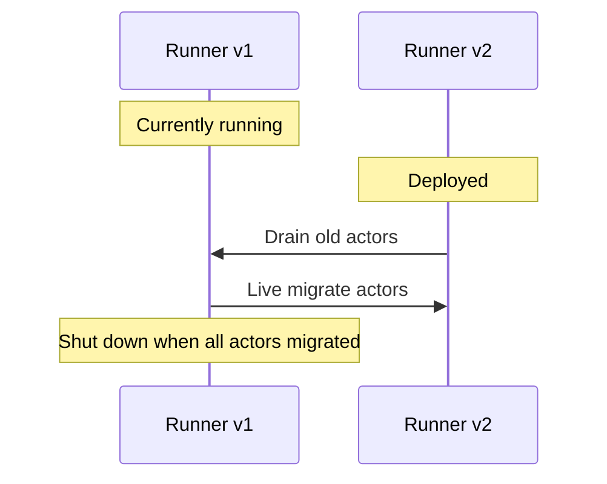
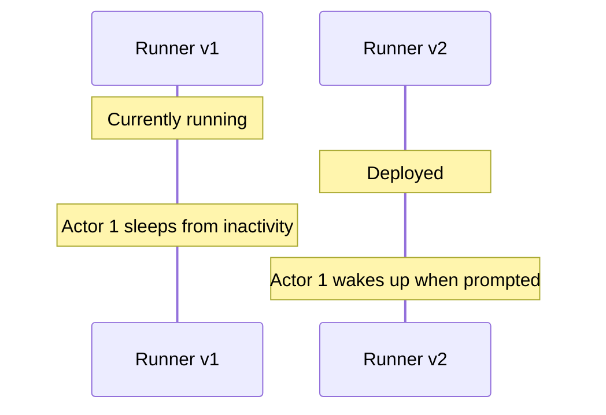

# Versions & Upgrades

> Source: `src/content/docs/actors/versions.mdx`
> Canonical URL: https://rivet.dev/docs/actors/versions
> Description: When you deploy new code, Rivet ensures actors are upgraded seamlessly without downtime.

---
## How Versions Work

Each runner has a **version number**. When you deploy new code with a new version, Rivet handles the transition automatically:

- **New actors go to the newest version**: When allocating actors, Rivet always prefers runners with the highest version number
- **Multiple versions can coexist**: Old actors continue running on old versions while new actors are created on the new version
- **Drain old actors**: When enabled, a runner connecting with a newer version number will gracefully stop old actors to be rescheduled to the new version

Versions are not configured by default. See [Registry Configuration](/docs/connect/registry-configuration) to learn how to configure the runner version.

`RIVET_RUNNER_VERSION` is only needed when self-hosting or using a custom runner. Rivet Compute handles versioning automatically.

### Example Scenario

### Drain Enabled

When a new version is deployed, existing actors are immediately drained from the old runner and live migrated to the new version.



### Drain Disabled

When a new version is deployed, both versions coexist. New actors are created on the new version while existing actors continue running on the old version until.



## Configuration

### Setting the Version

Configure the runner version using an environment variable or programmatically:

```bash {{"title": "Environment Variable"}}
RIVET_RUNNER_VERSION=2
```

```typescript {{"title": "Programmatic"}}
import { actor, setup } from "rivetkit";

const myActor = actor({ state: {}, actions: {} });

const registry = setup({
  use: { myActor },
  runner: {
    version: 2,
  },
});
```

The version **must** be set at build time, not at runtime. Do not use `Date.now()` or similar runtime values in your registry setup code. This would assign a different version every time the server starts, causing actors to be drained and rescheduled on every restart instead of only on new deployments.

### Example Configurations

We recommend injecting a build-time value that increments with every deployment. Here are concrete examples for common setups:

### Dockerfile

Generate the version at build time and bake it into the image as an environment variable:

```bash @nocheck
docker build --build-arg RIVET_RUNNER_VERSION=$(date +%s) .
```

```dockerfile @nocheck
FROM node:20-slim
ARG RIVET_RUNNER_VERSION
ENV RIVET_RUNNER_VERSION=$RIVET_RUNNER_VERSION
WORKDIR /app
COPY . .
RUN npm install && npm run build
CMD ["node", "dist/server.js"]
```

All containers from this image will share the same version.

### Next.js

Set the version in `next.config.ts`. Next.js evaluates this file once at build time and inlines the value into the bundle:

```typescript @nocheck
import type { NextConfig } from "next";

const nextConfig: NextConfig = {
  env: {
    RIVET_RUNNER_VERSION: String(Math.floor(Date.now() / 1000)),
  },
};

export default nextConfig;
```

### Vite

Use `define` in your Vite config. This is evaluated once at build time and inlined into the bundle:

```typescript @nocheck
import { defineConfig } from "vite";

export default defineConfig({
  define: {
    "process.env.RIVET_RUNNER_VERSION": JSON.stringify(
      String(Math.floor(Date.now() / 1000))
    ),
  },
});
```

### CI/CD

Set the version from your CI pipeline:

```yaml @nocheck
# GitHub Actions
env:
  RIVET_RUNNER_VERSION: ${{ github.run_number }}
```

```bash @nocheck
# Railway / Render / generic CI
export RIVET_RUNNER_VERSION=$(date +%s)
```

```bash @nocheck
# Git commit count
export RIVET_RUNNER_VERSION=$(git rev-list --count HEAD)
```

### Build Script

Generate a version file during your build step and import it:

```json @nocheck
{
  "scripts": {
    "build": "echo \"export const BUILD_VERSION = $(date +%s);\" > src/build-version.ts && tsc"
  }
}
```

```typescript @nocheck
import { actor, setup } from "rivetkit";
import { BUILD_VERSION } from "./build-version";

const myActor = actor({ state: {}, actions: {} });

const registry = setup({
  use: { myActor },
  runner: {
    version: BUILD_VERSION,
  },
});
```

### Drain on Version Upgrade

The `drainOnVersionUpgrade` option controls whether old actors are stopped when a new version is deployed. This is configured in the Rivet dashboard under your runner configuration.

| Value | Behavior |
|-------|----------|
| `false` (default in [runner mode](/docs/general/runtime-modes)) | Old actors continue running. New actors go to new version. Versions coexist. |
| `true` (default in [serverless mode](/docs/general/runtime-modes)) | Old actors receive stop signal and have 30s to finish gracefully. |

## Upgrading Actor State

When you deploy a new version, existing actors may need to handle schema changes in their persisted data.

### SQLite (recommended for complex schemas)

**Drizzle (recommended)**

Use [Drizzle](/docs/actors/sqlite-drizzle) for typed schemas with generated migrations. Drizzle generates versioned `.sql` migration files from your TypeScript schema and applies them in order automatically. This is the recommended approach when your schema evolves frequently.

**Raw SQL**

For actors using [raw SQLite](/docs/actors/sqlite), migrations run automatically via the `onMigrate` hook on every actor start. Use SQLite's `user_version` pragma to track which migrations have run:

```ts
import { actor, setup } from "rivetkit";
import { db } from "rivetkit/db";

const todoList = actor({
	db: db({
		onMigrate: async (db) => {
			const [{ user_version }] = (await db.execute(
				"PRAGMA user_version",
			)) as { user_version: number }[];

			if (user_version < 1) {
				await db.execute(`
					CREATE TABLE todos (
						id INTEGER PRIMARY KEY AUTOINCREMENT,
						title TEXT NOT NULL
					);
				`);
			}

			if (user_version < 2) {
				await db.execute(`
					ALTER TABLE todos ADD COLUMN completed INTEGER NOT NULL DEFAULT 0;
				`);
			}

			await db.execute("PRAGMA user_version = 2");
		},
	}),
	actions: {
		addTodo: async (c, title: string) => {
			await c.db.execute("INSERT INTO todos (title) VALUES (?)", title);
		},
	},
});

const registry = setup({ use: { todoList } });
registry.start();
```

### In-memory state (`c.state`)

If you use `c.state` for persistence, you are responsible for handling schema changes yourself. If you add, remove, or rename fields between versions, your code must handle the old shape gracefully.

**Manual defaults in `onWake`**

Apply defaults for missing fields:

```ts
import { actor, setup } from "rivetkit";

const myActor = actor({
	state: { count: 0, label: "" },
	onWake: (c) => {
		// Added in v2. Old actors won't have this field.
		c.state.label ??= "default";
	},
	actions: {
		getLabel: (c) => c.state.label,
	},
});

const registry = setup({ use: { myActor } });
registry.start();
```

**Zod schema coercion**

Use [Zod](https://zod.dev/) to parse persisted state on wake. Zod's `.default()` fills in missing fields automatically, so old actor state is coerced to the current schema:

```ts
import { actor, setup } from "rivetkit";
import { z } from "zod";

const stateSchema = z.object({
	count: z.number().default(0),
	label: z.string().default("default"), // Added in v2
});

type State = z.infer<typeof stateSchema>;

const myActor = actor({
	state: { count: 0, label: "default" } as State,
	onWake: (c) => {
		Object.assign(c.state, stateSchema.parse(c.state));
	},
	actions: {
		getLabel: (c) => c.state.label,
	},
});

const registry2 = setup({ use: { myActor } });
registry2.start();
```

For anything beyond simple defaults, consider moving to [SQLite](/docs/actors/sqlite) where you get proper migration tooling.

## Advanced

### How Version Upgrade Detection Works

When `drainOnVersionUpgrade` is enabled, Rivet uses two mechanisms to detect version changes:

- **New runner connection**: When a runner connects with a newer version number, the engine immediately drains all older runners with the same name. This is the primary mechanism for [runner mode](/docs/general/runtime-modes) deployments.
- **Metadata polling** (serverless only): In [serverless mode](/docs/general/runtime-modes), runners periodically poll the engine to check for newer versions and self-drain if one is found. This ensures old runners drain even if no new requests trigger a runner connection.

### SIGTERM Handling

When a runner process receives SIGTERM, it gracefully stops all actors before exiting:

- Each actor's `onSleep` hook is called, giving it time to save state
- Actors are rescheduled to other available runners
- The runner waits up to **120 seconds** for all actors to finish stopping
- If the process is force-killed before actors finish (e.g. SIGKILL), actors are rescheduled with a crash backoff penalty instead of a clean handoff

Ensure your platform's shutdown grace period is at least **130 seconds** to give actors time to stop cleanly.

### Shutdown Timeouts

Several timeouts control how long each part of the shutdown process can take:

| Timeout | Default | Description | Configuration |
|---------|---------|-------------|---------------|
| `actor_stop_threshold` | 30s | Engine-side limit on how long each actor has to stop before being marked lost | [Engine config](/docs/self-hosting/configuration) (`pegboard.actor_stop_threshold`) |
| `sleepGracePeriod` | 15s | Total graceful sleep budget for `onSleep`, `waitUntil`, async raw WebSocket handlers, and waiting for `preventSleep` to clear after shutdown starts | [Actor options](/docs/actors/lifecycle#options) |
| `runStopTimeout` | 15s | How long to wait for the `run` handler to exit | [Actor options](/docs/actors/lifecycle#options) |
| `runner_lost_threshold` | 15s | Fallback detection if the runner dies without graceful shutdown | [Engine config](/docs/self-hosting/configuration) (`pegboard.runner_lost_threshold`) |

Rivet has a max shutdown grace period of 30 minutes that cannot be configured.

## Related

- [Runtime Modes](/docs/general/runtime-modes): Serverless vs runner deployment modes
- [Lifecycle](/docs/actors/lifecycle): Actor lifecycle hooks including `onSleep`

_Source doc path: /docs/actors/versions_
