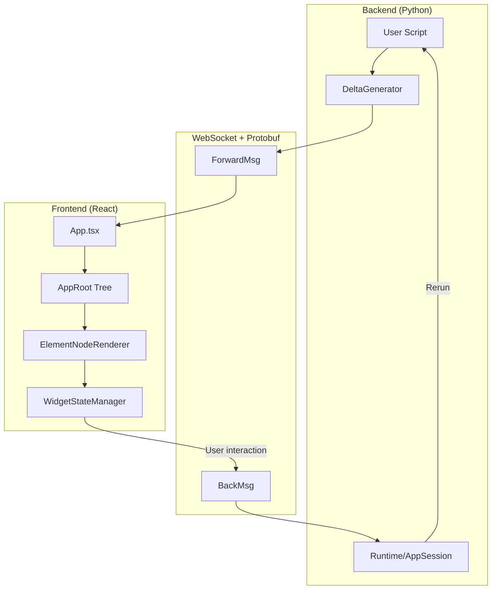

# Understanding Streamlit architecture

Streamlit is a client-server application with bidirectional WebSocket communication using Protocol Buffers.
Use this file as a quick mental model and navigation index; use `references/backend.md`, `references/frontend.md`, and `references/communication.md` for implementation details.

## Concepts glossary

| Concept | Description | Key files |
|---------|-------------|-----------|
| **Command** | Any function exposed in Streamlit's public API (`st.*` namespace). Commands can create elements/widgets, control execution flow, or configure app behavior. | `lib/streamlit/delta_generator.py`, `lib/streamlit/elements/`, `lib/streamlit/commands/` |
| **Element** | Umbrella term for all UI components in Streamlit: widgets, containers, and display elements. Represented in `Element.proto` as a `oneof` union of ~50+ types. | `proto/streamlit/proto/Element.proto`, `lib/streamlit/elements/` |
| **Widget** | Interactive element (button, slider, text_input) that triggers reruns on user interaction. Value accessible via return value or `st.session_state`. Some elements become widgets conditionally (e.g., dataframe/chart with `on_select`). | `lib/streamlit/elements/widgets/`, `frontend/lib/src/components/widgets/` |
| **Display Element** | Non-interactive element (text, markdown, image, chart) that renders content without triggering reruns by itself. | `lib/streamlit/elements/`, `frontend/lib/src/components/elements/` |
| **Container** | Layout block that groups elements spatially (sidebar, columns, expander, tabs, form). Represented as `BlockNode` in the element tree. | `lib/streamlit/elements/layouts.py`, `Block.proto` |
| **DeltaGenerator** | The `st` object; API entry point that queues UI deltas. Uses mixin pattern to compose all `st.*` commands. | `lib/streamlit/delta_generator.py` |
| **Session State** | Per-session dictionary (`st.session_state`) persisting data across reruns. Stores widget values and user variables. | `lib/streamlit/runtime/state/session_state.py` |
| **Rerun** | Re-execution of the user script for the current page. Triggered by widget interactions, `st.rerun()`, file changes, or fragment timers. Rebuilds the element tree while preserving session state. | `lib/streamlit/runtime/scriptrunner/script_runner.py`, `lib/streamlit/commands/execution_control.py` |
| **Form** | Container (`st.form`) that batches widget inputs, deferring reruns until form submission. | `lib/streamlit/elements/form.py`, `WidgetStateManager.ts` |
| **Fragment** | Decorator (`@st.fragment`) enabling partial reruns of specific UI sections without full script re-execution. | `lib/streamlit/runtime/fragment.py` |
| **Caching** | Decorators (`@st.cache_data`, `@st.cache_resource`) that memoize function results to avoid redundant computation. | `lib/streamlit/runtime/caching/` |
| **Pages** | Multipage app system using `st.navigation()` and `st.Page()` or auto-discovery from `pages/` directory. | `lib/streamlit/navigation/`, `lib/streamlit/runtime/pages_manager.py` |
| **Config** | App configuration via `.streamlit/config.toml` controlling server, client, and theme settings. | `lib/streamlit/config.py`, `lib/streamlit/config_option.py` |
| **Theming** | Customizable UI themes (Light/Dark/Custom) defined in config or via theme editor. | `lib/streamlit/runtime/theme_util.py`, `frontend/lib/src/theme/` |
| **Secrets** | Secure credential storage via `.streamlit/secrets.toml` (local) or platform settings (deployed). Accessed via `st.secrets`. | `lib/streamlit/runtime/secrets.py` |
| **Connection** | Database/service abstraction (`st.connection`) with built-in caching and secrets integration. | `lib/streamlit/connections/` |
| **Custom Components** | User-built extensions using React/iframe. **v1 (legacy)**: `declare_component()` API. **v2 (current)**: Bidirectional components with improved state management. | `frontend/component-lib/`, `frontend/component-v2-lib/`, `lib/streamlit/components/v1/`, `lib/streamlit/components/v2/` |
| **Static File Serving** | Files in `static/` directory served directly via `/app/static/*` (when static serving is enabled). | `lib/streamlit/web/server/server.py`, `lib/streamlit/web/server/starlette/starlette_routes.py` |
| **App Testing** | Testing framework (`AppTest`) for simulating user interactions and inspecting rendered output. | `lib/streamlit/testing/` |

## Core mental model

**Key insight**: Script execution is rerun-driven: most widget interactions trigger reruns (full app or fragment-scoped). State persists via `st.session_state` and caching decorators.

## Execution model

Streamlit's execution model differs from traditional web frameworks:

**Rerun triggers**:
1. **Widget interaction**: User clicks button, moves slider, etc.
2. **Source code change**: File watcher detects script modification
3. **`st.rerun()`**: Explicit programmatic rerun
4. **Fragment timer**: `@st.fragment(run_every=...)` periodic reruns

**Execution order nuances**:
- Scripts execute **top-to-bottom** on every rerun
- **Callbacks first**: `on_change`/`on_click` handlers run *before* the main script body
- **Fragments typically isolate reruns**: Widget interactions inside `@st.fragment` usually rerun only that fragment
- **Control flow exceptions**: `st.stop()`, `st.rerun()`, `st.switch_page()` raise exceptions to halt/redirect execution

**Session isolation**:
- Each browser tab = separate `AppSession` with its own `SessionState`
- Refreshing the page creates a new session (unless reconnecting within TTL)
- No shared state between sessions (use external storage for multi-user state)

**What persists across reruns** (within a session):
- `st.session_state` values
- Cached function results (`@st.cache_data`, `@st.cache_resource`)
- Uploaded files
- Fragment registrations

**What resets on each rerun**:
- Local variables in script
- Widget return values (re-read from `SessionState`)
- Element tree (rebuilt from scratch, then diffed)

## Architecture layers

### Backend (Python)

| Component | File | Purpose |
|-----------|------|---------|
| Runtime | `lib/streamlit/runtime/runtime.py` | Singleton managing app lifecycle and sessions |
| AppSession | `lib/streamlit/runtime/app_session.py` | Per-browser-tab: ScriptRunner + SessionState + ForwardMsgQueue |
| ScriptRunner | `lib/streamlit/runtime/scriptrunner/script_runner.py` | Executes user scripts in separate thread |
| DeltaGenerator | `lib/streamlit/delta_generator.py` | API entry point using mixin pattern |
| SessionState | `lib/streamlit/runtime/state/session_state.py` | Widget values and user variables |
| Elements | `lib/streamlit/elements/` | Backend implementation of `st.*` commands |

**For backend deep dive**: See [references/backend.md](references/backend.md)

### Frontend (TypeScript/React)

| Component | File | Purpose |
|-----------|------|---------|
| App | `frontend/app/src/App.tsx` | Central orchestrator |
| AppRoot | `frontend/lib/src/render-tree/AppRoot.ts` | Immutable element tree with 4 containers |
| ElementNodeRenderer | `frontend/lib/src/components/core/Block/ElementNodeRenderer.tsx` | Maps protos to React components |
| WidgetStateManager | `frontend/lib/src/WidgetStateManager.ts` | Widget state, forms, query params |
| ConnectionManager | `frontend/connection/src/ConnectionManager.ts` | WebSocket state machine |

**For frontend deep dive**: See [references/frontend.md](references/frontend.md)

### Communication (Protobuf)

| Proto | Purpose |
|-------|---------|
| `ForwardMsg.proto` | Server to client: deltas, session events, navigation |
| `BackMsg.proto` | Client to server: rerun requests with widget states |
| `Element.proto` | ~50+ element types in `oneof type` union |
| `WidgetStates.proto` | Widget values: `trigger_value`, `string_value`, `bool_value`, etc. |

**Location**: `proto/streamlit/proto/`

**For protocol deep dive**: See [references/communication.md](references/communication.md)

## Essential concepts (quick map)

- **Layout system**: Width/height parameters for elements, flexbox containers, and responsive sizing.
  - Deep dive: [references/layout.md](references/layout.md)
- **Script rerun model**: Widget interaction -> `BackMsg` (`ClientState`) -> backend updates `SessionState` -> script rerun -> `ForwardMsg` deltas.
  - Deep dive: `references/communication.md#widget-interaction-to-script-rerun`
- **Delta path system**: Elements are addressed by delta paths (for example `[0, 2, 3]`) to support efficient tree updates.
  - Deep dive: `references/communication.md#delta-ui-changes`
- **`active_script_hash` semantics**: `ForwardMsg.metadata.active_script_hash` scopes node ownership across multipage and fragment reruns.
  - Deep dive: `references/communication.md#forwardmsg-metadata-active_script_hash`
- **Element tree structure**: Frontend `AppRoot` maintains `main`, `sidebar`, `event`, and `bottom` containers with `BlockNode`/`ElementNode`.
  - Deep dive: `references/frontend.md#element-tree-frontendlibsrcrender-tree`
- **Element identity semantics**: Delta paths decide where a node lives; element IDs decide whether stateful elements can reconnect to prior state after remounts.
  - Deep dive: `references/element-identity.md`
- **Fragments (`@st.fragment`)**: Fragment interactions usually trigger fragment-scoped reruns and update only affected regions.
  - Deep dive: [references/backend.md](references/backend.md#fragment-system-stfragment)

## Element identity

- **Delta path** controls where a node is placed in the render tree.
- **Element ID** controls whether a stateful element can reconnect to prior state after remounts.
- **Widgets** use the ID to connect frontend `WidgetStateManager` state, `BackMsg.WidgetStates`, backend `SessionState`, callbacks, and `st.session_state`.
- **Some non-widgets** also use IDs for frontend-only reconstruction (for example chart view state or media autoplay guards).
- **Delta-path changes can remount elements**, but a stable `element.id` can still let React preserve a leaf when it remains under the same rendered parent list.

Deep dive: `references/element-identity.md`

## Key implementation patterns

- **Backend mixin composition**: `DeltaGenerator` composes `st.*` API via mixins.
  - Deep dive: `references/backend.md#deltagenerator-libstreamlitdelta_generatorpy`
- **Frontend visitor pattern**: Render-tree updates/staleness cleanup use visitors.
  - Deep dive: `references/frontend.md#visitor-pattern`
- **Message deduplication**: `ForwardMsg.hash` + `ref_hash` with frontend `ForwardMsgCache` reduces bandwidth.
  - Deep dive: `references/communication.md#message-caching`

## Quick reference: adding features

1. **Proto definition**: `proto/streamlit/proto/<Element>.proto`
2. **Register in Element.proto**: Add to `oneof type`
3. **Backend mixin**: `lib/streamlit/elements/<element>.py`
4. **Frontend component**: `frontend/lib/src/components/elements/<Element>/` or `frontend/lib/src/components/widgets/<Element>/` (depending on element vs widget)
5. **Register in ElementNodeRenderer**: Add case to switch statement
6. **Compile protos**: `make protobuf`

See `wiki/new-feature-guide.md` for a detailed implementation guide.

## Maintaining this documentation

When making changes that impact any of the concepts documented here (Runtime, AppSession, DeltaGenerator, element tree, communication protocol, element identity, etc.), update the relevant sections in this skill's files (`SKILL.md`, `references/backend.md`, `references/frontend.md`, `references/communication.md`, `references/element-identity.md`) to keep them accurate.
