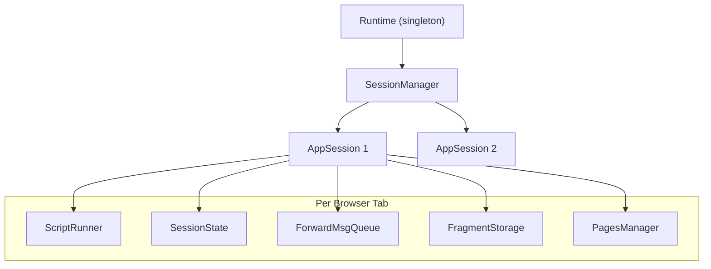
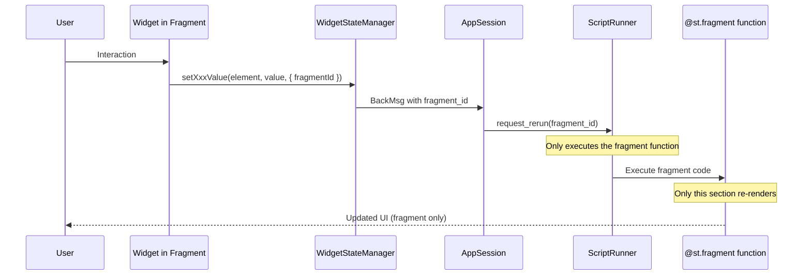
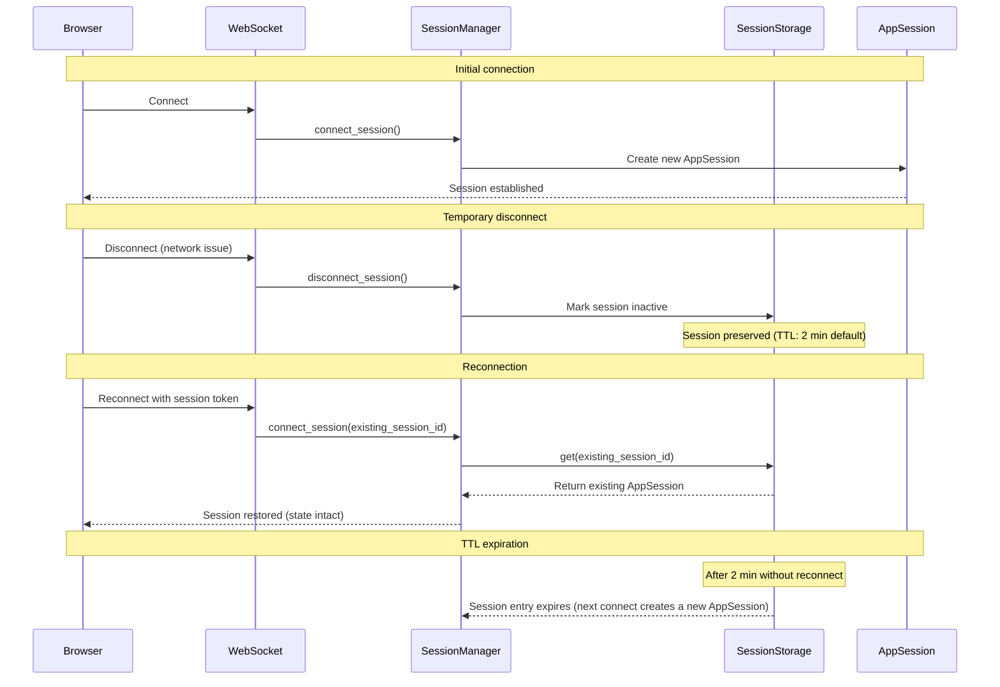
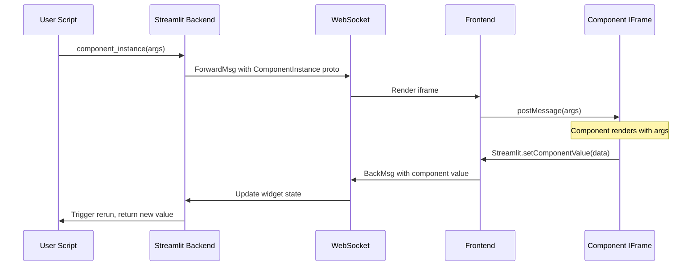

# Backend architecture

Deep dive into Streamlit's Python backend.

## Execution hierarchy



## Runtime (`lib/streamlit/runtime/runtime.py`)

Singleton managing the application lifecycle. Access via `Runtime.instance()`.

**Core responsibilities**:
- Runs the main asyncio event loop (`_loop_coroutine`) that flushes ForwardMsg queues to clients
- Manages subsystems: SessionManager, MediaFileManager, UploadedFileManager, ScriptCache, ComponentRegistry
- Coordinates thread-safe communication between script threads and the event loop via `asyncio.call_soon_threadsafe()`

**Message flush cycle**: Script threads enqueue ForwardMsgs and signal via `_enqueued_some_message()` callback → main loop wakes, iterates sessions, calls `flush_browser_queue()` → sends to clients via `SessionClient`

## AppSession (`lib/streamlit/runtime/app_session.py`)

Represents a single browser tab.

**Lifecycle**:
1. WebSocket connects -> `Runtime.connect_session()`
2. Creates `AppSession` (ScriptRunner starts when the first `rerun_script` BackMsg arrives)
3. Widget interaction -> `handle_backmsg()` -> `request_rerun()`
4. Script produces ForwardMsgs -> queued -> flushed to browser
5. WebSocket disconnects -> cleanup

**File watchers**: Monitors script, config.toml, secrets.toml, pages/ for changes.

## Session bootstrap ordering

Initial session creation and first script run are intentionally decoupled:

1. Backend WebSocket handler accepts connection and calls `Runtime.connect_session()`
2. Runtime/SessionManager creates (or reconnects) `AppSession`
3. Frontend transitions to `CONNECTED` and immediately sends `BackMsg.rerun_script` via `WidgetStateManager.sendUpdateWidgetsMessage()`
4. `AppSession.request_rerun()` creates/starts `ScriptRunner` for the first script execution

This ordering explains why `connect_session()` alone does not start user code execution.

## ScriptRunner (`lib/streamlit/runtime/scriptrunner/script_runner.py`)

Executes user scripts in isolated thread.

**Execution flow**:
1. Compile script to bytecode (cached via ScriptCache)
2. Create fake `__main__` module
3. Attach `ScriptRunContext` to thread
4. Execute with `exec()` in modified sys.path
5. Process widget callbacks before execution
6. Handle fragments for partial reruns

**Script events**:
- `SCRIPT_STARTED`
- `SCRIPT_STOPPED_WITH_SUCCESS`
- `SCRIPT_STOPPED_WITH_COMPILE_ERROR`
- `SCRIPT_STOPPED_FOR_RERUN` (st.rerun() called)
- `FRAGMENT_STOPPED_WITH_SUCCESS`

**Interrupt points**: Most `st.*` commands check for stop/rerun requests and raise `RerunException` or `StopException`.

## ScriptRunContext (`lib/streamlit/runtime/scriptrunner_utils/script_run_context.py`)

Thread-local context during script execution.

**Key fields**:
- `session_id`: Unique session identifier
- `session_state`: SafeSessionState wrapper
- `query_string`: URL query parameters
- `page_script_hash`: Current page identifier
- `widget_ids_this_run`: Widgets seen in current run
- `cursors`: Delta path cursors for element positioning
- `fragment_storage`: Storage for @st.fragment functions

**Access**: `get_script_run_ctx()` from any code during script execution.

## DeltaGenerator (`lib/streamlit/delta_generator.py`)

The `st` object users interact with.

**Mixin pattern**: Composes many mixins (one per element category) for all `st.*` API methods. See `lib/streamlit/delta_generator.py` for the full list.

**Cursor system**:
- `RunningCursor`: Moves forward as elements added
- `LockedCursor`: Fixed position for updating elements
- Delta path: `[0, 2, 3]` uniquely identifies element position

**Element creation**:
```
st.button("Click")
  -> ButtonMixin.button()
  -> _enqueue("button", ButtonProto(...))
  -> ForwardMsg with delta path
  -> ScriptRunContext.enqueue()
```

## SessionState (`lib/streamlit/runtime/state/session_state.py`)

Dictionary-like object for state persistence.

**Contents**:
- Widget values (automatic via `register_widget()`)
- User variables (`st.session_state.my_var = 123`)
- Query params integration (`st.query_params`)

**Widget registration**:
```python
register_widget(
    element_id,
    on_change_handler=callback,
    deserializer=serde.deserialize,
    serializer=serde.serialize,
    value_type="trigger_value",  # Maps to WidgetState proto field
)
```

**Lifecycle hooks**:
- `on_script_will_rerun()`: Process widget states from browser, run callbacks
- `on_script_finished()`: Clean up stale widgets not seen this run

## Caching (`lib/streamlit/runtime/caching/`)

**@st.cache_data** (`cache_data_api.py`):
- Pickle-based caching for data (DataFrames, lists)
- In-memory + optional disk persistence
- TTL support, max entries limit

**@st.cache_resource** (`cache_resource_api.py`):
- Stores singleton resources (DB connections, ML models)
- No serialization (stores objects directly)
- Cleanup hooks on cache clear

## Web server (`lib/streamlit/web/server/`)

**Key endpoints**:
- `/_stcore/stream`: WebSocket for bidirectional messages
- `/_stcore/health`: Health check
- `/_stcore/upload_file/<session>/<file>`: File uploads
- `/media/*`: Media files (images, videos)
- `/component/*`: Custom component v1 resources
- `/_stcore/bidi-components/*`: v2 bidi component resources

**WebSocket handler** (`browser_websocket_handler.py`):
```
Browser connects -> Runtime.connect_session()
                 -> Create AppSession
                 -> Browser sends first rerun request
                 -> Start ScriptRunner
                 -> Messages flow bidirectionally
                 -> Browser disconnects -> Runtime.disconnect_session()
```

## Key abstractions

| Interface | Purpose | Default Implementation |
|-----------|---------|------------------------|
| SessionManager | Session lifecycle | WebsocketSessionManager |
| SessionStorage | Session persistence | MemorySessionStorage |
| UploadedFileManager | File uploads | MemoryUploadedFileManager |
| MediaFileStorage | Media files | MemoryMediaFileStorage |
| CacheStorageManager | Cache backend | LocalDiskCacheStorageManager |

## Fragment system (`@st.fragment`)

Fragments enable partial reruns of specific UI sections without re-executing the entire script.

**Key files**:
- `lib/streamlit/runtime/fragment.py`: Fragment decorator and execution logic
- `lib/streamlit/runtime/scriptrunner/script_runner.py`: Fragment-aware execution

**How fragments work**:



**Fragment storage** (`FragmentStorage`):
- Each `AppSession` has a `FragmentStorage` instance
- Stores registered fragment functions by `fragment_id`
- Preserves fragment state across partial reruns

**Fragment identification**:
- Each fragment gets a unique `fragment_id` (hash of function identity + delta-path context)
- Frontend tracks `fragmentIdsThisRun` to know which fragments are active
- Delta messages include `fragment_id` for proper tree updates

**Staleness with fragments**:
- Elements track both `scriptRunId` and `fragmentId`
- During fragment reruns, stale cleanup uses `scriptRunId` + `fragmentIdsThisRun` to prune affected subtrees while preserving unrelated nodes
- Main script elements are preserved during fragment-only reruns

**Script events for fragments**:
- `FRAGMENT_STOPPED_WITH_SUCCESS`: Fragment completed successfully
- Interrupted fragment runs can still emit `SCRIPT_STOPPED_FOR_RERUN`

## Session reconnection

Sessions can survive temporary disconnections via `SessionStorage`.

**Disconnect vs close**:
- **Disconnect**: WebSocket closes but session preserved in storage (default 2 min TTL)
- **Close**: Session explicitly terminated and cleaned up

**Reconnection flow**:



**Key components**:
- `WebsocketSessionManager` (`lib/streamlit/runtime/websocket_session_manager.py`): Manages session lifecycle
- `MemorySessionStorage` (`lib/streamlit/runtime/memory_session_storage.py`): Default in-memory storage with TTL
- `SessionStorage` interface: Allows custom storage backends

**What's preserved on reconnect**:
- `SessionState` (all user variables and widget values)
- `FragmentStorage` (registered fragments)
- Uploaded files (via `UploadedFileManager`)
- Media files (via `MediaFileManager`)

**What's NOT preserved**:
- WebSocket connection state
- Transport-level delivery guarantees during the disconnect window
- Script execution state (script restarts from beginning)

**Configuration**:
- TTL is controlled by `MemorySessionStorage` (default 120 seconds)
- `MemorySessionStorage` uses `cachetools.TTLCache`; expiry removes stored `SessionInfo` entries and does not invoke an explicit `AppSession.shutdown()` callback path
- Custom `SessionStorage` implementations can use alternative storage strategies

## Media file management (`lib/streamlit/runtime/media_file_manager.py`)

Media files (images, audio, video) are managed separately from the protobuf element tree.

**Flow**:
1. `st.image(data)` -> `MediaFileManager.add()` registers file with unique ID
2. File stored in `MediaFileStorage` (default: in-memory)
3. Element proto contains URL: `/media/<file_id>.<ext>`
4. Frontend fetches media via HTTP GET (not WebSocket)
5. Garbage collection removes unused files after script runs

**Key concepts**:
- **Coordinates**: Each file tracks its location in the app (delta path) to handle replacements (e.g., animation frames)
- **Session tracking**: Files are associated with sessions; removed when no sessions reference them
- **Deferred callables**: `st.download_button` with callable data uses `DeferredCallableEntry` for lazy evaluation

**Multi-server considerations**:
- Media requests may hit different servers than the WebSocket connection
- Solutions: session affinity (sticky sessions) or base64-encode media into element protos

## Custom components (`lib/streamlit/components/`)

Custom components extend Streamlit via iframe-isolated React apps.

**Two API versions**:
- **v1 (legacy)** (`lib/streamlit/components/v1/`): Original `declare_component()` API, assets served via `/component/*`
- **v2 (current)** (`lib/streamlit/components/v2/`): Bidirectional components with improved state management, assets via `/_stcore/bidi-components/*`

**Communication flow**:


**Key files**:
- `lib/streamlit/components/v1/custom_component.py`: v1 component registration
- `lib/streamlit/components/v2/bidi_component/`: v2 bidirectional implementation
- `component-lib/`: NPM package for building components (`streamlit-component-lib`)
