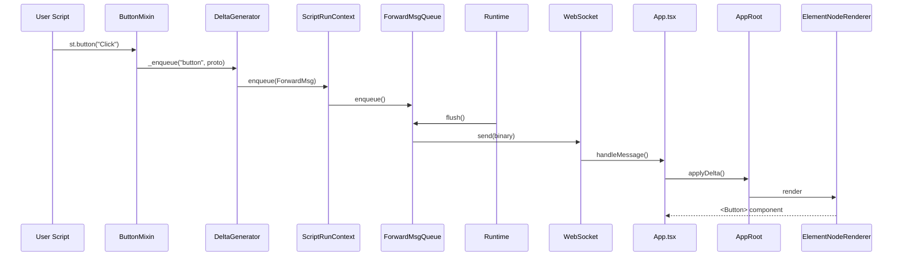
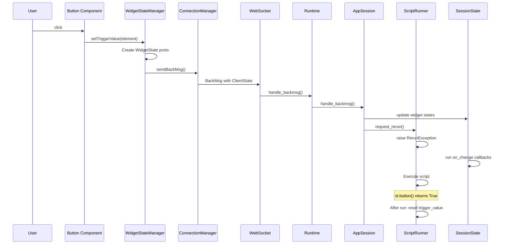

# Communication protocol

Deep dive into Streamlit's protobuf communication layer.

## Proto file location

`proto/streamlit/proto/` contains all `.proto` files.

Compile with: `make protobuf`

**Generated code**:
- Python: `lib/streamlit/proto/*_pb2.py` and `*_pb2.pyi`
- TypeScript: `frontend/protobuf/proto.js` + `frontend/protobuf/proto.d.ts` (package: `@streamlit/protobuf`)

## ForwardMsg (server to client)

`ForwardMsg.proto` - Root message sent from backend to frontend.

```protobuf
message ForwardMsg {
  string hash = 1;                    // Unique hash for caching
  ForwardMsgMetadata metadata = 2;    // Contains delta_path

  oneof type {
    NewSession new_session = 4;
    Delta delta = 5;
    ScriptFinishedStatus script_finished = 6;
    SessionStatus session_status_changed = 9;
    Navigation navigation = 23;
    string ref_hash = 11;             // Reference to cached message
    // ... more types
  }
}
```

**Key types**:
- `delta`: UI updates (new elements, blocks, transients)
- `new_session`: Initial session setup, config, pages
- `script_finished`: Signals script completion
- `ref_hash`: Reference to cached message (bandwidth optimization)

## ForwardMsg metadata (`active_script_hash`)

`ForwardMsgMetadata` carries routing/context fields that are not part of hashed payload content:

```protobuf
message ForwardMsgMetadata {
  bool cacheable = 1;
  repeated uint32 delta_path = 2;
  string active_script_hash = 4;
  // ... more fields
}
```

**Semantics**:
- Backend sets `metadata.active_script_hash` from `ScriptRunContext.active_script_hash`
- On run reset, active hash is initialized to the main script hash
- In MPA v2, page execution runs under page hash context (`run_with_active_hash(page_hash)`)
- Fragment reruns restore the fragment's initialized active hash for stable element/widget identity
- Frontend stores this as `activeScriptHash` on render-tree nodes and uses it in page filtering (`FilterMainScriptElementsVisitor`)

## BackMsg (client to server)

`BackMsg.proto` - Messages from frontend to backend.

```protobuf
message BackMsg {
  oneof type {
    ClientState rerun_script = 11;    // Main rerun trigger
    bool stop_script = 7;
    // ... more types
  }
}
```

**ClientState** (key field):
```protobuf
message ClientState {
  WidgetStates widget_states = 2;    // Current frontend-tracked widget values
  string page_script_hash = 3;
  string fragment_id = 5;
  // ... more fields
}
```

## Delta (UI changes)

`Delta.proto` - Incremental UI updates.

```protobuf
message Delta {
  oneof type {
    Element new_element = 3;          // Add UI element
    Block add_block = 6;              // Add container
    // ... more types
  }
  string fragment_id = 8;
}
```

**Delta path**: Array in metadata like `[0, 2, 3]` specifying tree position.

## Element types

`Element.proto` - ~50+ element types in `oneof type` union.

**Categories**:
- Text: `alert`, `markdown`, `text`, `heading`, `code`
- Data: `dataframe`, `table`, `json`, `metric`
- Charts: `vega_lite_chart`, `plotly_chart`, `deck_gl_json_chart`
- Input widgets: `button`, `checkbox`, `slider`, `text_input`, `selectbox`, `multiselect`
- Date/time: `date_input`, `time_input`, `date_time_input`
- Media: `audio`, `video`, `imgs`
- Special: `spinner`, `progress`, `toast`, `exception`
- Components: `component_instance`, `bidi_component`

## Component resource routes

Component deltas are transported over protobuf, but frontend assets are served over HTTP routes:
- `component_instance` (v1) assets: `/component/*`
- `bidi_component` (v2) assets: `/_stcore/bidi-components/*`
- These routes complement, not replace, WebSocket protobuf messaging

## Block types

`proto/streamlit/proto/Block.proto` defines layout containers (`st.container`, `st.expander`, `st.form`, `st.tabs`, `st.columns`, `st.chat_message`, `st.popover`, `st.dialog`). Modern column/container layouts use `FlexContainer`.

## WidgetStates

`proto/streamlit/proto/WidgetStates.proto` defines widget value transport. Each `WidgetState` has an `id` and a `oneof value` union supporting various types (bool, double, int, string, arrays, JSON, Arrow tables, file uploader state, etc.).

**Important**: `trigger_value` and `json_trigger_value` auto-reset to default after script run (used for buttons and similar transient interactions).

## Message flow diagrams

### Script execution to browser update



### Widget interaction to script rerun



## Message caching

ForwardMsgs include `hash` for deduplication:

1. Backend computes hash of message content
2. Frontend maintains `ForwardMsgCache`
3. For unchanged content, backend sends `ref_hash` instead of full message
4. Frontend retrieves from cache using hash

**Benefit**: Reduces bandwidth for large/unchanged elements.

## Key design decisions

| Decision | Problem | Solution |
|----------|---------|----------|
| Delta paths | Efficient tree updates | Array-based paths like `[0, 2, 3]` |
| Message caching | Bandwidth for large elements | Hash-based deduplication |
| Oneof unions | Type-safe variants | Protobuf `oneof` for Element, Block, Delta |
| Trigger vs persistent | Buttons should fire once | `trigger_value` auto-resets |
| Arrow format | Slow dataframe serialization | Apache Arrow columnar format |
