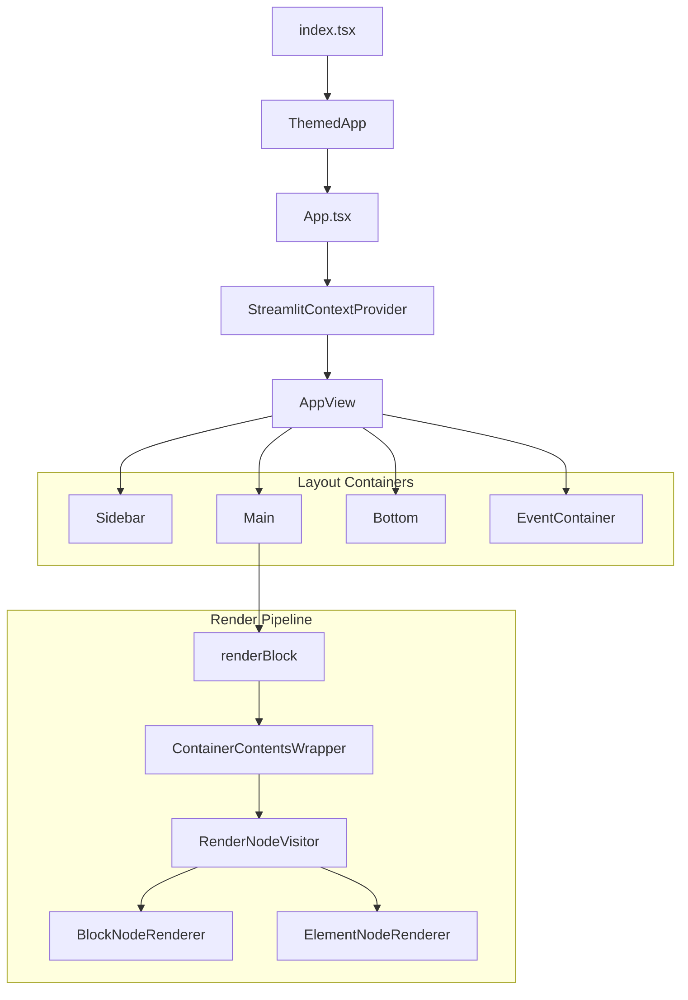

# Frontend architecture

Deep dive into Streamlit's TypeScript/React frontend.

## Component hierarchy



## App.tsx (`frontend/app/src/App.tsx`)

Central orchestrator managing everything.

**Key responsibilities**:
- Manages WebSocket connection via `ConnectionManager`
- Handles all message types via `handleMessage` method
- Maintains `AppRoot` element tree in state
- Coordinates script run state

**ForwardMsg handling by type** (essential types shown):
- `newSession`: Initializes session metadata and script-run context; clears transients or page state as needed
- `delta`: Updates tree via `AppRoot.applyDelta()`
- `scriptFinished`: Clears stale nodes, removes inactive widget state, increments message cache run count
- `sessionStatusChanged`: Updates script run state
- `navigation`: Handles MPA page changes
- `pageConfigChanged`: Updates page title, icon, layout

## Element tree (`frontend/lib/src/render-tree/`)

### AppRoot (`AppRoot.ts`)

Immutable root with 4 top-level containers:
- `main`: Primary content area
- `sidebar`: Sidebar elements
- `event`: Toasts, balloons, transient effects
- `bottom`: Sticky elements (chat input)

**Key methods**:
- `applyDelta()`: Processes Delta messages
- `clearStaleNodes()`: Removes elements from previous runs
- `filterMainScriptElements()`: Filters by script hash (MPA)

### Node types

**BlockNode** (`BlockNode.ts`):
- Container for children (BlockNode | ElementNode | TransientNode)
- Contains `BlockProto` (layout containers like: columns, expanders, forms, tabs, dialogs)
- Tracks: `scriptRunId`, `fragmentId`, `activeScriptHash`

**ElementNode** (`ElementNode.ts`):
- Leaf node for UI elements
- Contains `Element` protobuf message
- Lazy-loads processed data (Quiver for dataframes)
- Handles `arrowAddRows` for incremental updates

**TransientNode** (`TransientNode.ts`):
- Holds transient elements (currently used for spinners) at a delta path position
- Maintains anchor node that persists after transient clears
- Auto-cleared when transient context exits

### Visitor pattern

Tree operations use visitors in `frontend/lib/src/render-tree/visitors/`:
- `ClearStaleNodeVisitor`: Removes outdated elements after script run
- `ClearTransientNodesVisitor`: Clears transient nodes (spinners)
- `SetNodeByDeltaPathVisitor`: Updates tree at specific path
- `GetNodeByDeltaPathVisitor`: Retrieves node at path
- `FilterMainScriptElementsVisitor`: Filters by script hash for MPA navigation

Rendering uses `RenderNodeVisitor` (`frontend/lib/src/components/core/Block/RenderNodeVisitor.tsx`) to convert tree to React elements.

## Rendering pipeline

### ElementNodeRenderer (`frontend/lib/src/components/core/Block/ElementNodeRenderer.tsx`)

Maps protobuf element types to React components via a switch statement.

**Features**:
- Lazy-loads most components via `React.lazy()`
- Wraps in `ElementContainer` with layout config
- Handles staleness with `Maybe` component

### BlockNodeRenderer

Handles containers: forms, tabs, columns, chat messages, expanders, dialogs, popovers.

## WidgetStateManager (`frontend/lib/src/WidgetStateManager.ts`)

Manages all widget state on the frontend.

**Core responsibilities**:
1. Widget state storage (top-level + per-form)
2. Form management (pending changes, uploads, submit buttons)
3. Trigger widget batching (coalesces updates via `setTimeout(0)`)
4. Query parameter bindings

**Methods**: Provides getter/setter pairs for each value type (`setTriggerValue`/`getTriggerValue`, `setStringValue`/`getStringValue`, `setBoolValue`/`getBoolValue`, etc.).

**Trigger batching**: Multiple trigger calls in same macrotask are batched to prevent race conditions.

**Element state**: Frontend-only state storage for components that need to persist state across remounts. Unlike widget state, element state is never sent to the server—it stays entirely in the browser. Useful when React components unmount and remount (e.g., during re-renders) but need to restore their previous UI state. Methods: `getElementState(elementId, key)`, `setElementState(elementId, key, value)`, `deleteElementState(elementId, key?)`. Inactive element states are cleaned up in `removeInactive()` after script runs.

**Cross-layer identity semantics**: See [element-identity.md](element-identity.md) for how `WidgetStateManager` relates to element IDs, delta paths, remount behavior, and backend `SessionState`.

## Connection management (`frontend/connection/src/`)

### ConnectionManager (`ConnectionManager.ts`)

High-level orchestrator deciding between WebSocket vs static connection.

### WebsocketConnection (`WebsocketConnection.tsx`)

Sophisticated state machine managing WebSocket lifecycle.

**States**:
```
INITIAL -> PINGING_SERVER -> CONNECTING -> CONNECTED
Any state -> DISCONNECTED_FOREVER (on fatal error)
```

**Features**:
- Tries multiple URIs with exponential backoff
- Uses `ForwardMsgCache` for message deduplication
- Maintains message ordering via index queue
- Handles session reconnection via tokens

### ForwardMsgCache (`ForwardMessageCache.ts`)

- Deduplicates messages by hash
- Resolves `ref_hash` messages against cached payloads
- Fragment-aware: keeps messages from active fragments

## React context architecture

**StreamlitContextProvider** provides 8 contexts organized by stability:

**Layer 1: Static config**
- `LibConfigContext`: Locale, Mapbox token, download behavior
- `SidebarConfigContext`: Sidebar state, width, logo

**Layer 2: Theme**
- `ThemeContext`: Active theme, available themes

**Layer 3: Runtime state**
- `NavigationContext`: Page links, current page, app pages
- `ViewStateContext`: Fullscreen state
- `ScriptRunContext`: Script run state/ID, fragment IDs (critical for staleness)
- `FormsContext`: Forms data (pending changes, uploads)
- `DownloadContext`: Deferred file request handler

## Key patterns

### Immutable updates
- Immer used extensively for state updates
- AppRoot operations return new instances
- Prevents mutation bugs in reactive system

### Staleness tracking
Every node tracks:
- `scriptRunId`: Which run created it
- `fragmentId`: Which fragment (if any)
- `deltaMsgReceivedAt`: Timestamp for ordering

Stale nodes are cleared after `scriptFinished`.

### Lazy loading
Components use `React.lazy()` for code splitting, deferring load until first render.

### Referential stability
Heavy use of `useMemo` and `useCallback` to prevent unnecessary re-renders.

## Host integration (`frontend/lib/src/hostComm/`, `frontend/utils/src/config/`)

Streamlit apps can be embedded in host platforms (e.g., Streamlit Community Cloud, enterprise portals) via iframe with bidirectional postMessage communication.

### Window preamble (`window.__streamlit`)

Hosts inject configuration before Streamlit loads via `window.__streamlit`:

```typescript
window.__streamlit = {
  BACKEND_BASE_URL: "https://app.example.com",     // WebSocket/API base
  HOST_CONFIG_BASE_URL: "https://host.example.com", // Host config endpoint
  MAIN_PAGE_BASE_URL: "https://app.example.com",   // For page links
  DOWNLOAD_ASSETS_BASE_URL: "...",                 // Media download base
  LIGHT_THEME: { ... },                            // Custom light theme
  DARK_THEME: { ... },                             // Custom dark theme
  HOST_CONFIG: {                                   // See below
    allowedOrigins: ["https://host.example.com"],
    useExternalAuthToken: true,
    // ...
  }
}
```

**Security**: Config is captured and deep-frozen at module load time (`frontend/utils/src/config/index.ts`) to prevent runtime tampering.

### Host config (`/_stcore/host-config` or `HOST_CONFIG`)

Tamper-proof configuration mechanism for host platforms. Hosts can override the `/_stcore/host-config` endpoint (e.g., via proxy) to apply platform-specific settings:

| Option | Purpose |
|--------|---------|
| `allowedOrigins` | Origins allowed to send postMessages |
| `useExternalAuthToken` | Wait for `SET_AUTH_TOKEN` before connecting |
| `enableCustomParentMessages` | Allow query-parameter synchronization and custom parent messages to be relayed to host integrations |
| `blockErrorDialogs` | Suppress error dialogs, send to host instead |
| `mapboxToken` | Platform-provided Mapbox token |
| `disableFullscreenMode` | Disable element fullscreen |

### PostMessage protocol

Bidirectional postMessage communication between host (parent iframe) and guest (Streamlit app). See `frontend/lib/src/hostComm/types.ts` for complete message definitions.

**Host-to-Guest** (`IHostToGuestMessage`) - essential types:
- `SET_AUTH_TOKEN`: Provide auth token for WebSocket connection
- `REQUEST_PAGE_CHANGE`: Navigate to different page
- `STOP_SCRIPT` / `RERUN_SCRIPT` / `CLEAR_CACHE`: Control script execution
- `TERMINATE_WEBSOCKET_CONNECTION`: Force disconnect

**Guest-to-Host** (`IGuestToHostMessage`) - essential types:
- `GUEST_READY`: App initialized, ready for messages
- `SET_APP_PAGES` / `SET_CURRENT_PAGE_NAME`: Report page state (MPA)
- `SCRIPT_RUN_STATE_CHANGED`: Report script state transitions
- `WEBSOCKET_CONNECTED` / `WEBSOCKET_DISCONNECTED`: Connection status

### Bypass mode

When `BACKEND_BASE_URL` and minimal `HOST_CONFIG` (allowedOrigins, useExternalAuthToken) are provided, frontend can skip the `/_stcore/host-config` fetch and connect directly to WebSocket, reducing initial load time.
